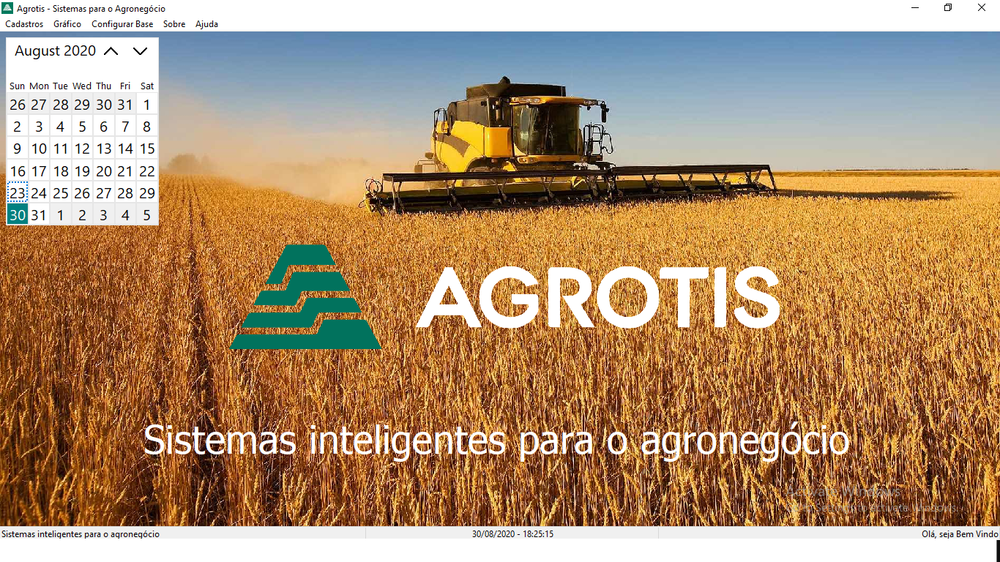

## Challenge to join as a Developer Delphi Agrotis Curitiba, Paraná.

## Technology
Using the Embarcadero RAD Studio 10.2 Tokyo Architect development IDE 25.0.26309.314

## Components
* Use of the FireDac bank connection component (native Embarcadeiro 10.2)
* Use Data Access, DataSet
* DbChart, to generate graphics.

## Microsoft SQL Server 2017 (RTM) - 14.0.1000.169 (X64)

A Database Bakcup was performed, just restore, it is at the root of the project folder called "DataBase", compressed.

## Information on accessing the database and connection of the systems.

* Database configuration can be done in the system menu at:
Menu> Configure Base

## Machine used for development
* Processor: AMD 1.0 Ghz
* RAM: 6.0 GB
* WIndows 10 Pro 64 Bit

Make with ❤ - @boscobecker
